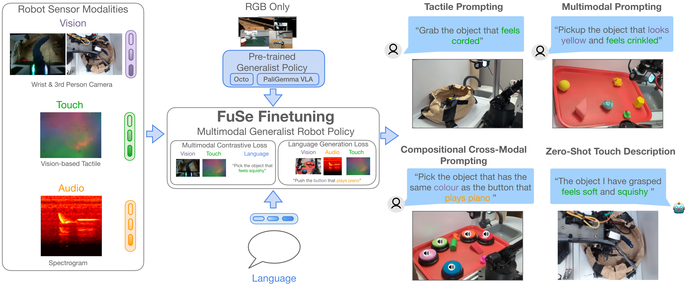

# Beyond Sight: Finetuning Generalist Robot Policies with Heterogeneous Sensors via Language Grounding
<!--[](https://arxiv.org/pdf/2408.11812)
[](https://huggingface.co/rail-berkeley/crossformer) -->
[](https://www.python.org)
[](https://opensource.org/licenses/MIT)
[](https://fuse-model.github.io/)

[Joshua Jones](https://www.linkedin.com/in/joshua-w-jones/), [Oier Mees](https://www.oiermees.com/), [Carmelo Sferrazza](https://sferrazza.cc/), [Pieter Abbeel](https://people.eecs.berkeley.edu/~pabbeel/), [Sergey Levine](https://people.eecs.berkeley.edu/~svlevine/)
<hr style="border: 2px solid gray;"></hr>

This repo contains code to **Fu**se heterogeneous **Se**nsory (FuSE) data, like touch sensing or audio, into generalist robot policies via language grounding. We release both a dataset of 26,866 robot trajectories collected heterogeneous sensory modalities and checkpoints for our two main models: Octo a large diffusion-based transformer model and a 3B VLA based on PaliGemma.
Our code is built on top of the [Octo](https://github.com/octo-models/octo) and [PaliVLA](https://github.com/kylestach/bigvision-palivla) codebases.



## Get Started
To install PaliVLA see the [PaliVLA README](palivla_digit/README.md). To install Octo see the [Octo README](octo_digit/README.md).


## Citation

```bibtex
@article{jones24fuse,
  title={Beyond Sight: Finetuning Generalist Robot Policies with Heterogeneous Sensors via Language Grounding},
  author={Joshua Jones and Oier Mees and Carmelo Sferrazza and Kyle Stachowicz and Pieter Abbeel and Sergey Levine},
  journal={arXiv preprint arXiv:foo}
  year={2024}
}
```